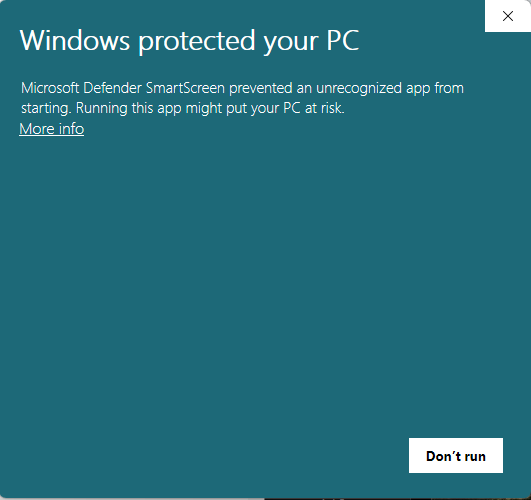

# QuietPlay

**A desktop music player for everyday listening.**

QuietPlay brings a local music library, playlists, synchronized lyrics, live
EQ, and a real-audio visualizer into one desktop app. An always-on-top mini
player keeps playback close at hand, and optional OBS tools support streaming.
Anyone can download the ready-to-use installer below; no QuietPlay account or
programming tools are required. Experimental Mac and Linux packages, when
listed, use native runtimes. Chromebook support uses the Linux environment.

**[Download QuietPlay](#get-quietplay)** &nbsp; / &nbsp;
**[Installation guide](#install-quietplay)** &nbsp; / &nbsp;
**[Start listening](#start-listening)** &nbsp; / &nbsp;
**[Request a feature](https://github.com/cooperwwwwww/QuietPlay-downloads/issues/new?template=feature_request.yml)** &nbsp; / &nbsp;
**[Report a bug](https://github.com/cooperwwwwww/QuietPlay-downloads/issues/new?template=bug_report.yml)**

[User guide](USER_GUIDE.md) | [FAQ](FAQ.md) | [What's new](CHANGELOG.md) |
[Platforms](PLATFORMS.md) | [Roadmap](ROADMAP.md) | [Get help](https://github.com/cooperwwwwww/QuietPlay-downloads/issues/new?template=help.yml)

> **Beta release:** QuietPlay is available for public testing and may still
> contain bugs. The installer is currently **unsigned**, so Windows may show a
> warning or block it. Review the [Windows security notice](#windows-security-notice)
> before installing. Do not disable Windows security.

## Get QuietPlay

<!-- release-summary:start -->
**QuietPlay 1.54.1 / Beta**

| Download | Best for |
| --- | --- |
| **[Download QuietPlay for Windows](https://github.com/cooperwwwwww/QuietPlay-downloads/releases/download/v1.54.1-development/QuietPlay-1.54.1-Beta-Setup.exe)** | Ready-to-use app with optional driver choices in setup. No ZIP extraction, Python, or developer tools needed. |
| **[Download for Linux / Chromebook Linux environment (ARM64)](https://github.com/cooperwwwwww/QuietPlay-downloads/releases/download/v1.54.1-development/QuietPlay-1.54.1-Beta-Linux-arm64.deb)** | Experimental Beta. [Requirements and platform limits](PLATFORMS.md). |
| **[Download for Linux / Chromebook Linux environment (Intel / AMD 64-bit)](https://github.com/cooperwwwwww/QuietPlay-downloads/releases/download/v1.54.1-development/QuietPlay-1.54.1-Beta-Linux-x86_64.deb)** | Experimental Beta. [Requirements and platform limits](PLATFORMS.md). |
| **[Download for macOS (Apple Silicon)](https://github.com/cooperwwwwww/QuietPlay-downloads/releases/download/v1.54.1-development/QuietPlay-1.54.1-Beta-macOS-arm64.dmg)** | Experimental Beta. [Requirements and platform limits](PLATFORMS.md). |
| **[Download for macOS (Intel)](https://github.com/cooperwwwwww/QuietPlay-downloads/releases/download/v1.54.1-development/QuietPlay-1.54.1-Beta-macOS-x86_64.dmg)** | Experimental Beta. [Requirements and platform limits](PLATFORMS.md). |

[Release notes and checksums](https://github.com/cooperwwwwww/QuietPlay-downloads/releases/tag/v1.54.1-development) | [All versions](https://github.com/cooperwwwwww/QuietPlay-downloads/releases)
<!-- release-summary:end -->

**Windows requirements:** Windows 10 or 11, 64-bit, and a working audio output. An
internet connection is needed for online search, downloads, and metadata
lookups, not for playing songs already stored on the PC. See the
[platform guide](PLATFORMS.md) for Mac, Linux and Chromebook requirements,
installation, availability and feature differences.

## Install QuietPlay

The steps below are for Windows. [Mac, Linux and Chromebook installation](PLATFORMS.md).

1. Select **Download QuietPlay for Windows** above. The file is named
   `QuietPlay-<version>-Beta-Setup.exe`.
2. Open the downloaded installer. If a Windows warning appears, read the steps
   below before continuing.
3. Follow setup and choose only the optional extras needed. Leave them
   unchecked for normal listening.
4. Open **QuietPlay** from the desktop or Start menu shortcut.

The app runtime, playback libraries, FFmpeg, and optional spotDL downloader are
included. There is no ZIP to extract and no separate Python or command-line
setup. GitHub's automatically generated source-code archives contain this
repository's documentation, not the installable app.

### Windows Security Notice

Windows may show the following **Microsoft Defender SmartScreen** screen.
QuietPlay is a new, unsigned Beta app without established download reputation;
that can trigger a warning. A new app is not automatically safe.

1. Confirm the installer came from this repository's
   [official releases](https://github.com/cooperwwwwww/QuietPlay-downloads/releases).
   [Compare the file with the published SHA-256 checksum](FAQ.md#check-the-downloaded-file);
   this verifies identity, not safety.
2. Select **More info**, shown on the left of the warning, to inspect the
   filename and publisher. The current unsigned installer may show
   **Unknown publisher**.
3. Only if the file is trusted and the risk is acceptable, select **Run anyway**
   if Windows offers it. This button is not visible in the first screen above;
   it may appear after selecting More info. Otherwise choose **Don't run**.

**Stop if Smart App Control, antivirus, or an administrator policy blocks the
file, or if Run anyway is unavailable.** Do not turn off those protections.
Smart App Control is different from this SmartScreen warning and has no
individual-app override. [Full Windows warning guide](FAQ.md#windows-protected-your-pc).

### Windows Installer + Optional Drivers

Both optional extras are **off by default**. Normal music playback needs
neither one.

| Optional Extra | When to Choose It |
| --- | --- |
| VB-CABLE | Separate music audio for OBS when a suitable routing device is not already installed. |
| Microsoft WebView2 | Embedded web tools when the runtime is missing. |

Selecting VB-CABLE opens its original signed installer and a Windows
administrator prompt. Complete or cancel that installer before QuietPlay setup
continues. A restart may be required. VB-CABLE is third-party VB-Audio
donationware with its own terms; it is not QuietPlay software.

[Optional-extras setup guide](OPTIONAL_DRIVERS.md) |
[VB-Audio licensing](https://vb-audio.com/Services/licensing.htm)

## Start Listening

**QuietPlay starts with an empty library. No music collection is included.**

1. Open Home and choose **Add files** for individual songs or **Add folder**
   for an existing music folder. Multiple files can be imported together.
2. Songs appear in Home. Select a song and press **Play**.
3. Use **Playlists**, **Artists**, **Albums**, or the search bar to organize and
   find music. Use Like and Dislike to shape local recommendations.
4. For optional online downloads, choose **Search music** on the empty Home
   screen, or open **Add music**. Only save recordings with permission to download.

No account or sign-in is required. Each operating-system user has an independent local
library, profile, playlists, preferences, and listening history.
[Read the getting-started guide](USER_GUIDE.md#add-existing-music).

## What QuietPlay Can Do

| Feature | What It Offers |
| --- | --- |
| Library and playlists | Multi-file imports, search, artist and album browsing, multi-select actions, and local song/artist mixes. |
| Playback | Queue, shuffle with actual listening history, speed controls, sleep timer, and Windows media controls. |
| Live audio controls | Volume, bass, midrange, and treble changes during playback. |
| Lyrics | In-app synchronized lyrics, line follow, and per-song timing adjustment when the provider's timing differs. |
| Visualizer | Visualization driven by real audio, with adjustable style, color, density, sensitivity, and response. |
| Mini player | Compact always-on-top playback, volume control, and adjustable opacity. |
| Metadata | Public artwork and genre lookups, cached results, and manual review for ambiguous recordings. |
| Personalization | Themes, custom colors, contrast options, and reduced motion. |
| OBS | Local now-playing overlay, separate stream audio, and optional dual output for local listening. |

Reopening restores the saved song and playback position and waits for Play by
default. Removing a song from the library does not have to delete its original
file; read the confirmation before choosing an action.

## Optional Online Search and Downloads

The main search bar searches saved music first and can also show online
matches. Local songs have **Play**; online-only results show
**Download to listen**. Completed downloads can be imported into Home or a
selected playlist.

For a complete collection, paste a public Spotify playlist or album link into
search and choose **Download full playlist/album**. The search preview's size
does not limit the full collection job. Individual tracks may be unavailable.

Open **Settings > Search & Downloads** to choose search behavior, file format,
quality, providers, artwork, lyrics, and the destination folder. Advanced
matching and network options are grouped under **Show advanced**.

**This is not access to Spotify's streaming catalog.** The optional spotDL
integration uses Spotify metadata and matches audio from other providers. It
does not download protected Spotify audio, guarantee every recording, or grant
music rights. Only download recordings with permission to save them. Online
availability, matching, artwork, genres, and lyric timing can vary.
[Download settings and full-collection guide](USER_GUIDE.md#download-a-complete-playlist-or-album).

## Use With OBS

Open **Settings > Streaming** for guided OBS setup. A **Browser Source** shows
the local now-playing overlay. Music audio uses a separate audio source and,
when needed, an optional routing device such as VB-CABLE. Dual output can send
music to OBS and the listening device at the same time.

[OBS setup guide](USER_GUIDE.md#obs). Displaying a song title does not grant
permission to broadcast the recording.

## Data and Privacy

- Library records, playlists, settings, listening history, and OBS connection
  details are stored locally for each operating-system user.
- The installer contains no personal library or listening data. Installing on
  another computer creates a separate local setup.
- QuietPlay does not automatically upload music or personal listening data to
  a public library server or GitHub.
- Enabled online providers receive the searches and song details needed for
  the requested service. Offline playback does not need those providers.

[Local data and backups](USER_GUIDE.md#your-data-on-this-pc).

## Updates and Support

Release notes and versioned installers are published on the
[Releases page](https://github.com/cooperwwwwww/QuietPlay-downloads/releases).
Use GitHub's **Watch > Custom > Releases** option for
[release notifications](https://docs.github.com/en/subscriptions-and-notifications/get-started/configuring-notifications).
Check **Settings > Updates** for the installed version. Normal installer
upgrades preserve local data, but back up important files first.

**Beta limitations:** the packages are unsigned prereleases. Automatic in-app
production updates remain disabled until trusted signing is available. Lyrics
and metadata may need manual review, and online providers can change
independently. Beta does not mean every feature or external service is faultless.

Published Windows builds go through automated tests, native UI checks,
package-integrity checks, and dependency vulnerability scans. Experimental
Mac/Linux packages have native runner checks, with untested hardware and
provider behavior clearly identified in their verification file. These checks
reduce risk; they do not guarantee the absence of bugs.

| Need Help With | Where to Go |
| --- | --- |
| Getting started or a common question | [User guide](USER_GUIDE.md) and [FAQ](FAQ.md) |
| An installation or setup question | [Ask for help](https://github.com/cooperwwwwww/QuietPlay-downloads/issues/new?template=help.yml) |
| A broken feature, slow operation, or visual problem | [Report a bug](https://github.com/cooperwwwwww/QuietPlay-downloads/issues/new?template=bug_report.yml) |
| An idea for an improvement | [Request a feature](https://github.com/cooperwwwwww/QuietPlay-downloads/issues/new?template=feature_request.yml) |
| Recent changes and planned priorities | [Changelog](CHANGELOG.md) and [roadmap](ROADMAP.md) |

GitHub requires an account to submit feedback; QuietPlay itself does not.
Include the app version, the steps taken, and the expected result. Requests
are reviewed, but no implementation date or response time is guaranteed.

**Feedback is public.** Do not attach music files, passwords, tokens, OBS
connection secrets, or unredacted logs. Remove personal details from screenshots.
[Feedback guide](CONTRIBUTING.md).

This repository hosts public downloads, documentation, and feedback. It does
not publish the app's private source or provide access to any music library.
Submitting feedback does not grant permission to modify the repository.

## Credits

Created and product-directed by **Cooper W.** Engineering and product design
developed in collaboration with **OpenAI Codex**.

QuietPlay is independent, is not affiliated with Spotify, and is not endorsed
by OpenAI. Third-party notices and licenses are included in the distribution.
