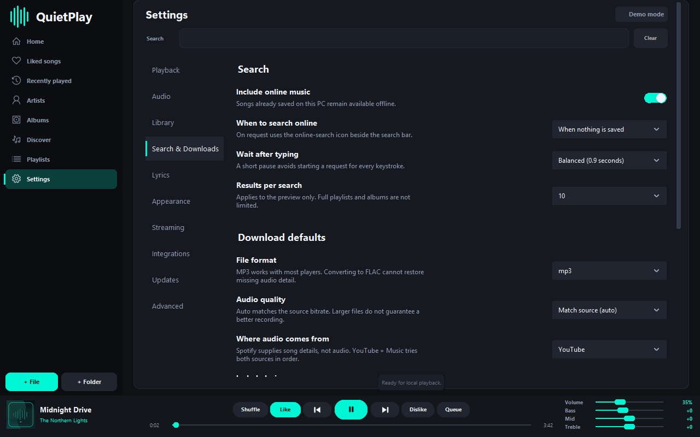

# QuietPlay

**A Windows music player built around your own library.**

QuietPlay brings local playback, playlists, lyrics, a real audio visualizer,
an always-on-top mini player, live EQ, and OBS tools into one desktop app.
Optional online search and spotDL downloads help you add music without leaving
the app.

[Downloads](https://github.com/cooperwwwwww/QuietPlay-downloads/releases) |
[User guide](USER_GUIDE.md) | [What's new](CHANGELOG.md) |
[Report a problem](https://github.com/cooperwwwwww/QuietPlay-downloads/issues)

> Current public builds are **unsigned development/testing builds**. Windows
> Smart App Control may block them. Do not turn off Windows security to install
> QuietPlay. A trusted code-signing identity is still needed for a normal signed
> public release and automatic in-app updates.

## Get QuietPlay

Open **Downloads** above and choose the newest version.

| File | Use it for |
| --- | --- |
| `QuietPlay-<version>-development-Setup.exe` | Normal installation with desktop and Start menu shortcuts. |
| `QuietPlay-for-testing-<version>-development.zip` | Shareable installer bundle with optional prerequisites and setup notes. |
| `QuietPlay-<version>-development-portable.zip` | Run without a normal installation; extract the entire archive first. |
| `SHA256SUMS.txt` | Check that your download matches the published files. |

Use the installer for the simplest setup. The application runtime, audio
libraries, FFmpeg, and spotDL companion are included. You do **not** need to
install Python, spotDL, or a command-line tool separately.

Normal music playback does not need a virtual audio driver. The optional
VB-CABLE package is for routing music separately to OBS. Driver installation
requires administrator approval and may require a restart. The bundle also
contains Microsoft's WebView2 bootstrapper for optional embedded web tools.

VB-CABLE is **VB-Audio donationware**, not QuietPlay software. Donations are
welcome; its own licensing terms apply. [VB-Audio licensing](https://vb-audio.com/Services/licensing.htm).

## Your Music

- Import multiple files or a whole folder; search the library immediately.
- Browse by song, artist, album, genre, favorites, or recent listening.
- Songs with several credited artists appear under each recognized artist.
- Build and edit playlists, add multiple selected tracks, and create local
  song/artist mixes from music already in your library.
- Like or dislike songs from playback controls. Dislikes affect automatic
  selection and local recommendations.
- Remove songs from the library without requiring you to delete the originals.
- Resume the saved song and position after reopening, waiting for Play by
  default rather than unexpectedly starting audio.

## Playback and Lyrics

- Previous follows actual listening history when shuffle is on. Next can replay
  the forward history after going back.
- Seek, shuffle, queue songs, change playback speed, and set a sleep timer.
- Adjust bass, midrange, treble, and volume while the song is playing.
- Use Windows taskbar/media controls and compatible headset media buttons.
- Keep a compact mini player above other windows, with playback and volume
  controls and adjustable opacity.
- Display synchronized lyrics inside the app. Follow the active line or adjust
  a song's timing offset when its lyric source is early or late.
- Customize the visualizer's style, colors, density, sensitivity, and response.
  Its playback animation comes from actual audio, not a decorative loop.

## Optional Online Search and Downloads

The main search bar searches saved music first. If no local songs match, it can
also show online results. Already-saved songs have Play; online-only songs show
**Download to listen**.

Paste a public Spotify song, playlist, or album link into search. Playlist and
album results offer **Download full playlist/album**, not just the small search
preview. In Add music, choose Home, an existing playlist, or a new playlist.
Completed downloads appear in the library without interrupting current playback.

Settings > **Search & Downloads** controls automatic/manual searching, format,
quality, audio sources, lyrics, artwork, and the download folder. More technical
filename, matching, and network options are grouped under **Show advanced**.

spotDL uses Spotify **metadata** and matches audio from other providers. It does
not download Spotify's protected audio, provide every Spotify recording, or
grant music rights. Only download recordings you have permission to save.
Availability, provider rules, matching accuracy, and lyrics timing can vary.

## Metadata and Artwork

QuietPlay can look up missing artwork and genre information using public music
metadata sources. Matching considers recording and artist information rather
than guessing a genre from the filename alone. It caches results and runs
lookups away from the UI thread.

Ambiguous recordings can still need manual review. A genre is not always a
single objective label, and public databases do not cover every song. QuietPlay
should not silently present an unsupported guess as verified metadata. The
guide explains reviewing matches and writing changes back to supported files.

## OBS and Personalization

- A localhost now-playing overlay exposes song information to an OBS Browser
  Source without publishing your library to a music server.
- Stream routing can send music to a separate output and, optionally, your
  headphones at the same time.
- Themes, visual color selection, contrast options, and reduced-motion settings
  let you tailor the interface.
- Audio, library, lyrics, appearance, streaming, and download preferences live
  in separate settings categories.

Displaying a song title in OBS does not grant streaming or copyright permission.

## Requirements and Privacy

Windows 10 or 11, 64-bit, with a working Windows audio output. Online search,
downloads, and metadata lookups need an internet connection. Offline playback
of your existing music does not.

Your library, playlists, and preferences are stored on your PC. Current QuietPlay
does not require an account and does not automatically upload your music to a
public library server. Enabled online services receive the queries or song
details needed for that service. OBS connection settings stay local.

## Testing and Updates

Published packages are built from pinned dependencies and go through automated
tests, native Windows UI checks, archive-integrity checks, and dependency
vulnerability scans. External providers can still change independently, so
please report failures with the QuietPlay version and steps to reproduce.

Every published version has release notes and versioned downloads. Unsigned
testing builds are explicitly marked as prereleases. Automatic in-app production
updates remain disabled until the trusted signing requirements are met.

## Credits

Created and product-directed by **Cooper W.** Engineering and product design
developed in collaboration with **OpenAI Codex**.

QuietPlay is independent, not affiliated with Spotify, and not endorsed by
OpenAI. Third-party notices and licenses are included in the distribution.
This repository hosts the public documentation and app downloads; the private
development workspace and personal music files are not published here.
